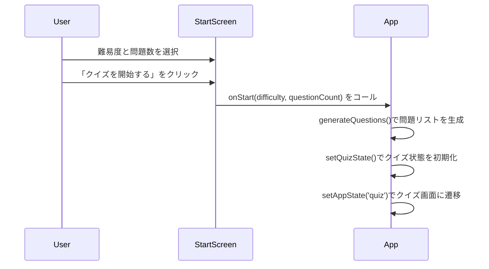
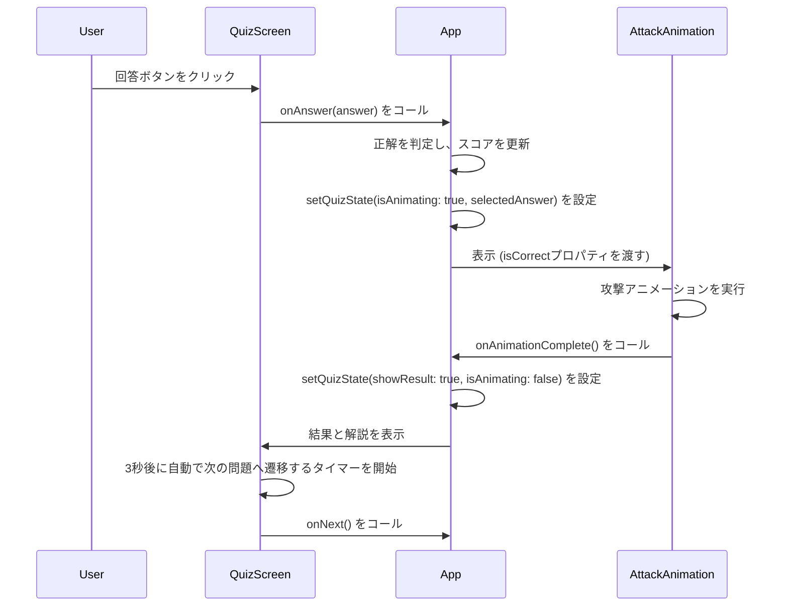
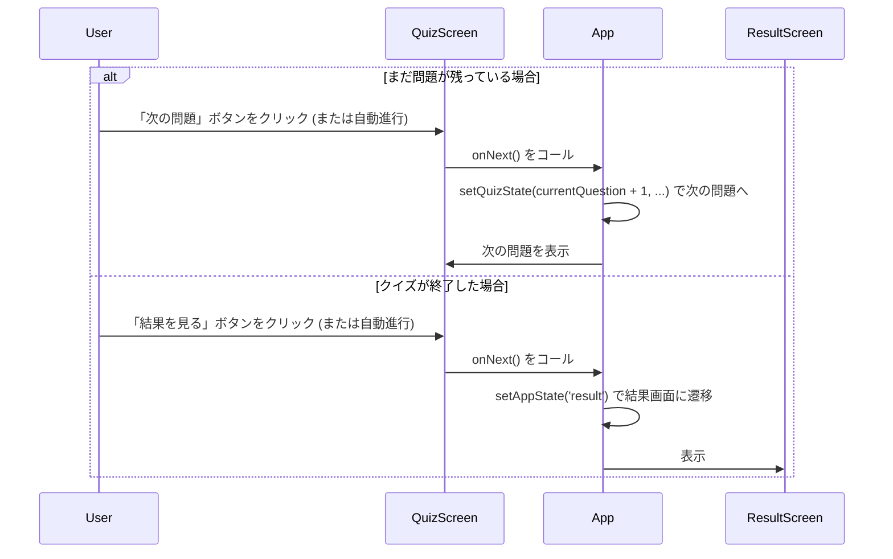

# ポケモンタイプ相性クイズアプリ 設計書

## 1. 概要
本ドキュメントは、「ポケモンタイプ相性クイズアプリ」の技術的な設計を定義するものです。`docs/requirements.md`で定義された要件をどのように実現するかを記述します。

## 2. アーキテクチャ

### 2.1. フロントエンドアーキテクチャ
- **フレームワーク**: React 18+ with TypeScript
- **UIライブラリ**: shadcn/ui をベースとしたコンポーネント群
- **スタイリング**: Tailwind CSS
- **状態管理**: React Hooks (`useState`) を使用したトップレベルコンポーネント (`App.tsx`) での集中管理方式を採用します。
- **アニメーション**: Framer Motion (`motion`) および CSS Animations
- **ビルドツール**: Vite または Create React App を想定

### 2.2. 全体構成
アプリケーションは `App.tsx` をルートコンポーネントとし、現在の状態 (`appState`) に応じて以下の3つの主要画面コンポーネントを切り替えて表示します。
- `StartScreen`: クイズ開始前の設定画面
- `QuizScreen`: クイズ進行中の画面
- `ResultScreen`: クイズ終了後の結果画面

クイズの状態 (`quizState`) は `App.tsx` で一元管理され、各画面コンポーネントに必要な情報と更新用関数がPropsとして渡される、トップダウンのデータフローを基本とします。

### 2.3. ディレクトリ構成
Figmaから出力されたコードをベースに、標準的なReactプロジェクトのディレクトリ構成を採用します。

```
/src
├── App.tsx                 # アプリケーションのメインロジックと状態管理
├── main.tsx                # アプリケーションのエントリポイント
├── components/
│   ├── ui/                 # shadcn/uiの基本コンポーネント
│   ├── AttackAnimation.tsx # 攻撃アニメーションコンポーネント
│   ├── QuizScreen.tsx      # クイズ画面コンポーネント
│   ├── ResultScreen.tsx    # 結果画面コンポーネント
│   ├── StartScreen.tsx     # スタート画面コンポーネント
│   └── TypeIcon.tsx        # タイプアイコン表示コンポーネント
├── styles/
│   └── globals.css         # グローバルCSS、Tailwind CSS定義
├── types/
│   └── pokemon.ts          # アプリケーションで使用する型定義
└── utils/
    └── quizLogic.ts        # クイズのロジック（問題生成、ダメージ計算など）
```

## 3. データモデル
アプリケーション内で使用される主要なデータ構造は `src/types/pokemon.ts` で定義されます。

- **`PokemonType`**: ポケモンの18タイプを表す文字列リテラル型。
  ```typescript
  export type PokemonType =
    | 'ノーマル' | 'ほのお' | 'みず' | 'でんき' | 'くさ' | 'こおり'
    | 'かくとう' | 'どく' | 'じめん' | 'ひこう' | 'エスパー' | 'むし'
    | 'いわ' | 'ゴースト' | 'ドラゴン' | 'あく' | 'はがね' | 'フェアリー';
  ```

- **`QuizQuestion`**: 一問分のクイズデータを保持するインターフェース。
  ```typescript
  export interface QuizQuestion {
    attackType: PokemonType;
    defendType: PokemonType | [PokemonType, PokemonType];
    correctAnswer: DamageMultiplier;
  }
  ```

- **`QuizState`**: クイズ全体の進行状態を管理するインターフェース。
  ```typescript
  export interface QuizState {
    currentQuestion: number;
    totalQuestions: number;
    score: number;
    difficulty: Difficulty;
    questions: QuizQuestion[];
    showResult: boolean;
    selectedAnswer: DamageMultiplier | null;
    isAnimating: boolean;
  }
  ```

- **`TYPE_EFFECTIVENESS`**: タイプ相性を定義するマトリクスデータ。
  ```typescript
  export const TYPE_EFFECTIVENESS: Record<PokemonType, Record<PokemonType, DamageMultiplier>>;
  ```

## 4. シーケンス図
Mermaid記法を用いて、主要なユーザーインタラクションのシーケンスを以下に示します。

### 4.1. クイズ開始シーケンス


### 4.2. 回答とアニメーションシーケンス


### 4.3. 次の問題へ・結果表示シーケンス


## 5. コンポーネント設計

### 5.1. `App.tsx`
- **役割**: アプリケーションの全体的な状態管理と画面遷移のロジックを担当するコンテナコンポーネント。
- **状態**:
  - `appState: 'start' | 'quiz' | 'result'`: 現在の画面状態。
  - `quizState: QuizState`: クイズの進行状況、スコア、問題データなど。
- **責務**:
  - 画面コンポーネント (`StartScreen`, `QuizScreen`, `ResultScreen`) の表示を切り替える。
  - クイズ開始、回答、次の問題へ、リスタートなどのイベントハンドラを定義し、子コンポーネントにPropsとして渡す。

### 5.2. `StartScreen.tsx`
- **役割**: ユーザーが難易度と問題数を選択し、クイズを開始するためのUIを提供。
- **状態**:
  - `difficulty: Difficulty`: 選択された難易度。
  - `questionCount: number`: 選択された問題数。
- **Props**:
  - `onStart: (difficulty: Difficulty, questionCount: number) => void`: クイズ開始を `App` コンポーネントに通知するコールバック。

### 5.3. `QuizScreen.tsx`
- **役割**: クイズの問題文、選択肢、進行状況を表示し、ユーザーの回答を受け付ける。
- **状態**:
  - `showExplanation: boolean`: 回答後の解説表示を制御。
  - `autoAdvanceTimer: number`: 自動進行までのタイマー。
- **Props**:
  - `quizState: QuizState`: 現在のクイズ状態。
  - `onAnswer: (answer: DamageMultiplier) => void`: ユーザーの回答を通知。
  - `onNext: () => void`: 次の問題への遷移を通知。
  - `onQuit: () => void`: クイズの中断を通知。

### 5.4. `ResultScreen.tsx`
- **役割**: クイズ終了後、最終スコア、正答率、評価を表示する。
- **Props**:
  - `quizState: QuizState`: 終了時のクイズ状態。
  - `onRestart: () => void`: 同じ設定で再挑戦する。
  - `onBackToMenu: () => void`: スタート画面に戻る。

### 5.5. `AttackAnimation.tsx`
- **役割**: ユーザーの回答後に、タイプ相性に基づいた攻撃アニメーションと正否判定をモーダルで表示する。
- **Props**:
  - `attackType: PokemonType`
  - `defendType: PokemonType | [PokemonType, PokemonType]`
  - `onAnimationComplete: () => void`: アニメーション完了を通知。
  - `isCorrect: boolean`: 正解か不正解か。

### 5.6. `TypeIcon.tsx`
- **役割**: ポケモンのタイプを視覚的に表現するアイコン。`docs/type_table.png`のデザインを参考に、SVGとして描画される。タイプに応じた色とアニメーションを持つ。
- **Props**:
  - `type: PokemonType`
  - `size: 'sm' | 'md' | 'lg'`
  - `animated: boolean`
- **内部実装**:
  - 外部画像ファイルに依存せず、コンポーネント内で完結したアイコン表示を実現するため、各タイプのアイコンはSVGコードとして直接コンポーネント内に実装する。
  - `getTypeSvgIcon(type: PokemonType)`のようなヘルパー関数を用意し、タイプ名に応じて対応するアイコンのSVG要素(JSX)を返す。
  - これにより、`type_table.png`のアイコンデザインをコードベースで再現する。
  - 例:
    ```jsx
    const getTypeSvgIcon = (type) => {
      switch (type) {
        case 'ほのお':
          return (
            <svg viewBox="0 0 24 24" fill="currentColor">
              <path d="..." /> // 炎の形のパスデータ
            </svg>
          );
        case 'みず':
          return (
            <svg viewBox="0 0 24 24" fill="currentColor">
              <path d="..." /> // 水滴の形のパスデータ
            </svg>
          );
        // ... 他の16タイプも同様に定義
      }
    }
    ```

### 5.7. `utils/quizLogic.ts`
- **役割**: クイズに関する純粋なロジック（計算やデータ生成）をまとめたユーティリティモジュール。UIから分離されている。
- **提供関数**:
  - `calculateDamage()`: ダメージ倍率を計算する。
  - `generateQuestions()`: 設定に基づいて問題リストを生成する。難易度「むずかしい」では、18タイプからランダムに2つを（重複しないように）組み合わせることで、動的に複合タイプを生成する。
  - `getAnswerChoices()`: 難易度に応じた選択肢の配列を返す。
  - `getAnswerText()`: ダメージ倍率を画面表示用のテキストに変換する。
  - `formatDefendType()`: 防御側のタイプを画面表示用にフォーマットする。
